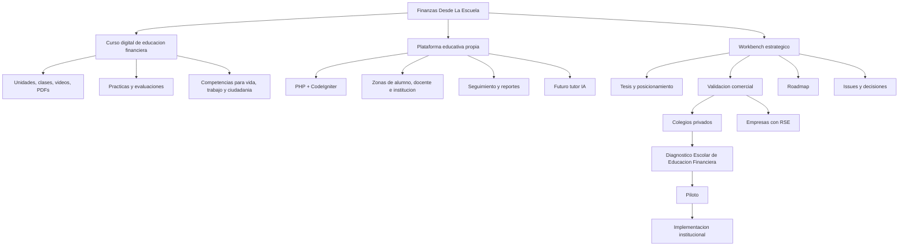

# Mapa visual

```mermaid
flowchart TD
  A["Finanzas Desde La Escuela"] --> B["Curso digital de educacion financiera"]
  A --> C["Plataforma educativa propia"]
  A --> D["Workbench estrategico"]

  B --> B1["Unidades, clases, videos, PDFs"]
  B --> B2["Practicas y evaluaciones"]
  B --> B3["Competencias para vida, trabajo y ciudadania"]

  C --> C1["PHP + CodeIgniter"]
  C --> C2["Zonas de alumno, docente e institucion"]
  C --> C3["Seguimiento y reportes"]
  C --> C4["Futuro tutor IA"]

  D --> D1["Tesis y posicionamiento"]
  D --> D2["Validacion comercial"]
  D --> D3["Roadmap"]
  D --> D4["Issues y decisiones"]

  D2 --> E["Colegios privados"]
  D2 --> F["Empresas con RSE"]

  E --> G["Diagnostico Escolar de Educacion Financiera"]
  G --> H["Piloto"]
  H --> I["Implementacion institucional"]
```

